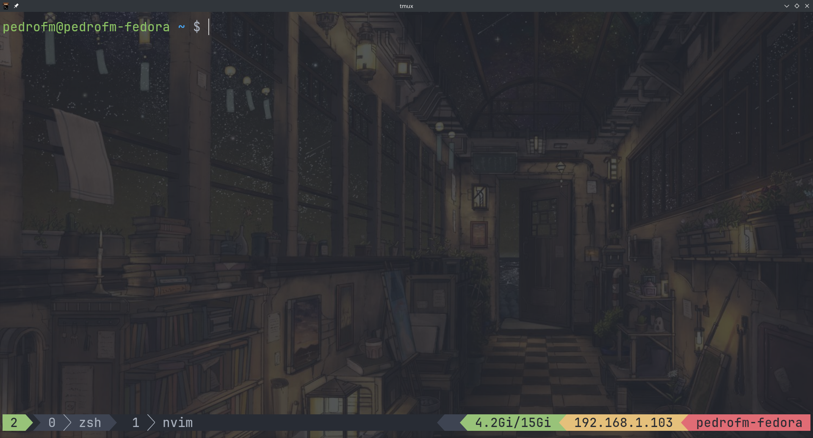

# tmux-onedark-theme
A dark tmux color scheme for terminal that support [True Color](https://en.wikipedia.org/wiki/Color_depth#True_color_.2824-bit.29), based on [onedark.vim](https://github.com/joshdick/onedark.vim), which is inspired by [One Dark syntax theme](https://github.com/atom/one-dark-syntax) for the [Atom text editor](https://atom.io).

## Why?

I wanted both neo vim and tmux to share the same color scheme.
I forked the original OneDark Pro tmux theme because I wanted to add some widgets
and improve the scalability of the code.

<https://github.com/odedlaz/tmux-onedark-theme> 



### Set Options

**!** Set the following options in your `.tmux.conf`

#### widgets

Widgets can be controlled by setting `@onedark_widgets`, for example:

```
set -g @onedark_widgets "date,git"
```

Once set, these widgets will show on the right.

The available widgets are:

- date
- git
- ip
- hostname
- ram

You can chose them in any order.

If you leave one of the 4 available widget spaces empty it will
display without text, only the color.

#### Date format

Date format can be controlled by setting `@onedark_date_format`, for example:

```
set -g @onedark_date_format "%D"
```

`%D` - Equivalent to %m/%d/%y (American format).   
`%m` - The month as a decimal number.  
`%d` - The day of the month as a decimal number  
`%y` - The year as a decimal number without the century.  

**default**: `%d/%m/%Y` - The date in non-American format.

These modifiers were taken from from [strftime manpage](http://man7.org/linux/man-pages/man3/strftime.3.html).

### Installation with [Tmux Plugin Manager](https://github.com/tmux-plugins/tpm) (recommended)

Add plugin to the list of TPM plugins in `.tmux.conf`:

```
set -g @plugin 'pedrofmu/tmux-onedark-theme'
```

Hit `prefix + I` to fetch the plugin and source it.

### Manual Installation

Clone the repo:

```
$ git clone https://github.com/pedrofmu/tmux-onedark-theme /a/path/you/choose
```

Add this line to the bottom of `.tmux.conf`:

```
run-shell /a/path/you/choose tmux-onedark-theme.tmux
```

Reload TMUX environment (type this in terminal)
```
$ tmux source-file ~/.tmux.conf
```

## Issues

### Symbols are missing

   The theme requires Powerline symbols exist and set on your system. Follow [these instructions](https://github.com/powerline/fonts) to install them, then update your terminal fonts to use them.

### Symbols are corrupted

   Patched Powerline fonts aren't picked up when `$LANG` isn't set to `en_US`.  
   You can change the default locale settings at `/etc/default/locale`.

   
### Widgets not working

   Make sure that you put the `set -g @plugin 'pedrofmu/tmux-onedark-theme'` before other scripts that alter the status line, or they won't be able to pickup the plugin's changes.

### True Color

   tmux version <= 2.3, don't support true color in the status line.
   [Support has been added](https://github.com/tmux/tmux/issues/490), and will probably ship in the next release.
   You can compile tmux and enjoy True Color right away!

   Make sure TrueColor is enabled and working. follow [these instructions](https://sunaku.github.io/tmux-24bit-color.html#usage) to do so.

### License

[MIT](LICENSE)
